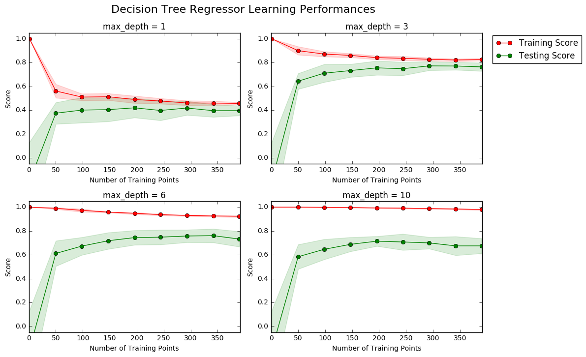
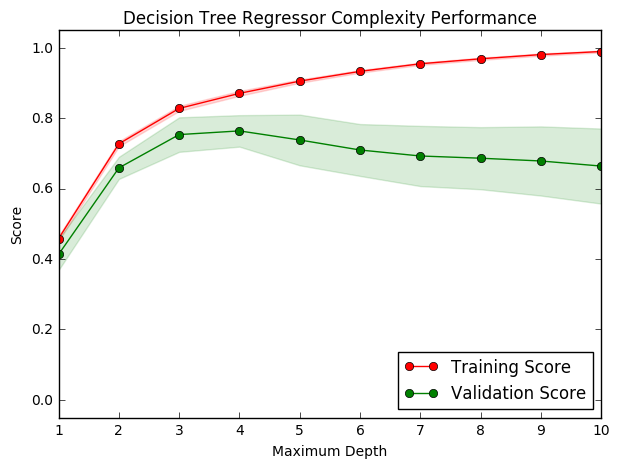

# Machine Learning Engineer Nanodegree
## Model Evaluation & Validation
## Project: Predicting Boston Housing Prices

Welcome to the first project of the Machine Learning Engineer Nanodegree! In this notebook, some template code has already been provided for you, and you will need to implement additional functionality to successfully complete this project. You will not need to modify the included code beyond what is requested. Sections that begin with **'Implementation'** in the header indicate that the following block of code will require additional functionality which you must provide. Instructions will be provided for each section and the specifics of the implementation are marked in the code block with a 'TODO' statement. Please be sure to read the instructions carefully!

In addition to implementing code, there will be questions that you must answer which relate to the project and your implementation. Each section where you will answer a question is preceded by a **'Question X'** header. Carefully read each question and provide thorough answers in the following text boxes that begin with **'Answer:'**. Your project submission will be evaluated based on your answers to each of the questions and the implementation you provide.  

>**Note:** Code and Markdown cells can be executed using the **Shift + Enter** keyboard shortcut. In addition, Markdown cells can be edited by typically double-clicking the cell to enter edit mode.

## Getting Started
In this project, you will evaluate the performance and predictive power of a model that has been trained and tested on data collected from homes in suburbs of Boston, Massachusetts. A model trained on this data that is seen as a *good fit* could then be used to make certain predictions about a home — in particular, its monetary value. This model would prove to be invaluable for someone like a real estate agent who could make use of such information on a daily basis.

The dataset for this project originates from the [UCI Machine Learning Repository](https://archive.ics.uci.edu/ml/datasets/Housing). The Boston housing data was collected in 1978 and each of the 506 entries represent aggregated data about 14 features for homes from various suburbs in Boston, Massachusetts. For the purposes of this project, the following preprocessing steps have been made to the dataset:
- 16 data points have an `'MEDV'` value of 50.0. These data points likely contain **missing or censored values** and have been removed.
- 1 data point has an `'RM'` value of 8.78. This data point can be considered an **outlier** and has been removed.
- The features `'RM'`, `'LSTAT'`, `'PTRATIO'`, and `'MEDV'` are essential. The remaining **non-relevant features** have been excluded.
- The feature `'MEDV'` has been **multiplicatively scaled** to account for 35 years of market inflation.

Run the code cell below to load the Boston housing dataset, along with a few of the necessary Python libraries required for this project. You will know the dataset loaded successfully if the size of the dataset is reported.


```python
# Import libraries necessary for this project
import numpy as np
import pandas as pd
from sklearn.cross_validation import ShuffleSplit

# Import supplementary visualizations code visuals.py
import visuals as vs

# Pretty display for notebooks
%matplotlib inline

# Load the Boston housing dataset
data = pd.read_csv('housing.csv')
prices = data['MEDV']
features = data.drop('MEDV', axis = 1)
    
# Success
print "Boston housing dataset has {} data points with {} variables each.".format(*data.shape)
```

    Boston housing dataset has 489 data points with 4 variables each.


## Data Exploration
In this first section of this project, you will make a cursory investigation about the Boston housing data and provide your observations. Familiarizing yourself with the data through an explorative process is a fundamental practice to help you better understand and justify your results.

Since the main goal of this project is to construct a working model which has the capability of predicting the value of houses, we will need to separate the dataset into **features** and the **target variable**. The **features**, `'RM'`, `'LSTAT'`, and `'PTRATIO'`, give us quantitative information about each data point. The **target variable**, `'MEDV'`, will be the variable we seek to predict. These are stored in `features` and `prices`, respectively.

### Implementation: Calculate Statistics
For your very first coding implementation, you will calculate descriptive statistics about the Boston housing prices. Since `numpy` has already been imported for you, use this library to perform the necessary calculations. These statistics will be extremely important later on to analyze various prediction results from the constructed model.

In the code cell below, you will need to implement the following:
- Calculate the minimum, maximum, mean, median, and standard deviation of `'MEDV'`, which is stored in `prices`.
  - Store each calculation in their respective variable.


```python
# TODO: Minimum price of the data
minimum_price = prices.min()

# TODO: Maximum price of the data
maximum_price = prices.max()

# TODO: Mean price of the data
mean_price = prices.mean()

# TODO: Median price of the data
median_price = prices.median()

# TODO: Standard deviation of prices of the data
std_price = prices.std()

# Show the calculated statistics
print "Statistics for Boston housing dataset:\n"
print "Minimum price: ${:,.2f}".format(minimum_price)
print "Maximum price: ${:,.2f}".format(maximum_price)
print "Mean price: ${:,.2f}".format(mean_price)
print "Median price ${:,.2f}".format(median_price)
print "Standard deviation of prices: ${:,.2f}".format(std_price)
```

    Statistics for Boston housing dataset:
    
    Minimum price: $105,000.00
    Maximum price: $1,024,800.00
    Mean price: $454,342.94
    Median price $438,900.00
    Standard deviation of prices: $165,340.28


### Information about the different price range.
In the code cell below, i will take a look at the different values at the prices of minimum, maximum and median.


```python
Min = data.loc[data['MEDV'] == 105000]
Max = data.loc[data['MEDV'] == 1024800]
Median = data.loc[data['MEDV'] == 438900]
print "Min \n{}".format(Min)
print "\n"
print "Max \n{}".format(Max)
print "\n"
print "Median \n{}".format(Median)
```

    Min 
            RM  LSTAT  PTRATIO      MEDV
    381  5.453  30.59     20.2  105000.0
    388  5.683  22.98     20.2  105000.0
    
    
    Max 
            RM  LSTAT  PTRATIO       MEDV
    253  8.398   5.91     13.0  1024800.0
    
    
    Median 
            RM  LSTAT  PTRATIO      MEDV
    69   5.885   8.79     18.9  438900.0
    247  5.876   9.25     16.4  438900.0


### Question 1 - Feature Observation
As a reminder, we are using three features from the Boston housing dataset: `'RM'`, `'LSTAT'`, and `'PTRATIO'`. For each data point (neighborhood):
- `'RM'` is the average number of rooms among homes in the neighborhood.
- `'LSTAT'` is the percentage of homeowners in the neighborhood considered "lower class" (working poor).
- `'PTRATIO'` is the ratio of students to teachers in primary and secondary schools in the neighborhood.

_Using your intuition, for each of the three features above, do you think that an increase in the value of that feature would lead to an **increase** in the value of `'MEDV'` or a **decrease** in the value of `'MEDV'`? Justify your answer for each._  
**Hint:** Would you expect a home that has an `'RM'` value of 6 be worth more or less than a home that has an `'RM'` value of 7?

**Answer: **
- *Increase* in **RM** would lead to an *increase* of **MEDV**
- *Increase* in **LSTAT** would lead to an *decrease* of **MEDV**
- *Increase* in **PTRATIO** would lead to an *decrease* of **MEDV**

----

## Developing a Model
In this second section of the project, you will develop the tools and techniques necessary for a model to make a prediction. Being able to make accurate evaluations of each model's performance through the use of these tools and techniques helps to greatly reinforce the confidence in your predictions.

### Implementation: Define a Performance Metric
It is difficult to measure the quality of a given model without quantifying its performance over training and testing. This is typically done using some type of performance metric, whether it is through calculating some type of error, the goodness of fit, or some other useful measurement. For this project, you will be calculating the [*coefficient of determination*](http://stattrek.com/statistics/dictionary.aspx?definition=coefficient_of_determination), R<sup>2</sup>, to quantify your model's performance. The coefficient of determination for a model is a useful statistic in regression analysis, as it often describes how "good" that model is at making predictions. 

The values for R<sup>2</sup> range from 0 to 1, which captures the percentage of squared correlation between the predicted and actual values of the **target variable**. A model with an R<sup>2</sup> of 0 is no better than a model that always predicts the *mean* of the target variable, whereas a model with an R<sup>2</sup> of 1 perfectly predicts the target variable. Any value between 0 and 1 indicates what percentage of the target variable, using this model, can be explained by the **features**. _A model can be given a negative R<sup>2</sup> as well, which indicates that the model is **arbitrarily worse** than one that always predicts the mean of the target variable._

For the `performance_metric` function in the code cell below, you will need to implement the following:
- Use `r2_score` from `sklearn.metrics` to perform a performance calculation between `y_true` and `y_predict`.
- Assign the performance score to the `score` variable.


```python
# TODO: Import 'r2_score'
from sklearn.metrics import r2_score
def performance_metric(y_true, y_predict):
    """ Calculates and returns the performance score between 
        true and predicted values based on the metric chosen. """
    
    # TODO: Calculate the performance score between 'y_true' and 'y_predict'
    score = r2_score(y_true, y_predict)
    
    # Return the score
    return score

```

### Question 2 - Goodness of Fit
Assume that a dataset contains five data points and a model made the following predictions for the target variable:

| True Value | Prediction |
| :-------------: | :--------: |
| 3.0 | 2.5 |
| -0.5 | 0.0 |
| 2.0 | 2.1 |
| 7.0 | 7.8 |
| 4.2 | 5.3 |
*Would you consider this model to have successfully captured the variation of the target variable? Why or why not?* 

Run the code cell below to use the `performance_metric` function and calculate this model's coefficient of determination.


```python
# Calculate the performance of this model
score = performance_metric([3, -0.5, 2, 7, 4.2], [2.5, 0.0, 2.1, 7.8, 5.3])
print "Model has a coefficient of determination, R^2, of {:.3f}.".format(score)
```

    Model has a coefficient of determination, R^2, of 0.923.


**Answer:**

Can't tell yet, need to visualize the data and the curve.

But considering the high R^2 one can assume the model has done a good job capturing the variation of the target model.

### Implementation: Shuffle and Split Data
Your next implementation requires that you take the Boston housing dataset and split the data into training and testing subsets. Typically, the data is also shuffled into a random order when creating the training and testing subsets to remove any bias in the ordering of the dataset.

For the code cell below, you will need to implement the following:
- Use `train_test_split` from `sklearn.cross_validation` to shuffle and split the `features` and `prices` data into training and testing sets.
  - Split the data into 80% training and 20% testing.
  - Set the `random_state` for `train_test_split` to a value of your choice. This ensures results are consistent.
- Assign the train and testing splits to `X_train`, `X_test`, `y_train`, and `y_test`.


```python
# TODO: Import 'train_test_split'
from sklearn.cross_validation import train_test_split
# TODO: Shuffle and split the data into training and testing subsets
X_train, X_test, y_train, y_test = train_test_split(features,prices, test_size=0.2, random_state=42)

# Success
print "Training and testing split was successful."
```

    Training and testing split was successful.


### Question 3 - Training and Testing
*What is the benefit to splitting a dataset into some ratio of training and testing subsets for a learning algorithm?*  
**Hint:** What could go wrong with not having a way to test your model?

**Answer: **
To reduce the risk of **overfitting**

----

## Analyzing Model Performance
In this third section of the project, you'll take a look at several models' learning and testing performances on various subsets of training data. Additionally, you'll investigate one particular algorithm with an increasing `'max_depth'` parameter on the full training set to observe how model complexity affects performance. Graphing your model's performance based on varying criteria can be beneficial in the analysis process, such as visualizing behavior that may not have been apparent from the results alone.

### Learning Curves
The following code cell produces four graphs for a decision tree model with different maximum depths. Each graph visualizes the learning curves of the model for both training and testing as the size of the training set is increased. Note that the shaded region of a learning curve denotes the uncertainty of that curve (measured as the standard deviation). The model is scored on both the training and testing sets using R<sup>2</sup>, the coefficient of determination.  

Run the code cell below and use these graphs to answer the following question.


```python
# Produce learning curves for varying training set sizes and maximum depths
vs.ModelLearning(features, prices)
```





### Question 4 - Learning the Data
*Choose one of the graphs above and state the maximum depth for the model. What happens to the score of the training curve as more training points are added? What about the testing curve? Would having more training points benefit the model?*  
**Hint:** Are the learning curves converging to particular scores?

**Answer: **

I choose the algorithm with **max_depth=3**, as it achieves the highest testing score. In addition, it also has the least uncertainty of the four models presented at 400 training points.

- *What happens to the score of the training curve as more training points are added?*

As we add more training points the ability of the algorithm to accurately predict another training point decreases as the overfitting decreases. 

- *What about the testing curve?*

As more training points are added the ability to accurately predict a data point of the test set increases considerably for the first 50 training sets, and continues to increase slightly as we add new training sets. In addition, as we add more training points, the uncertainty of the the curve seems to decrease, and has it narrowest area at 400 training points. Since the goal assess the accuracy to predict new points with the help of the algorithm, the performance of the test set is of most importance.

- *Would having more training points benefit the model?*

From what we can see, adding more data points would only have a slight positive increase of accuracy on the testing curve, but could have a higher positive effect on the uncertainty of the curve. So depending on the energy that is needed to fetch more data to train the model, we can based on that choose whether to add more data points or stay with 400 training points.

### Complexity Curves
The following code cell produces a graph for a decision tree model that has been trained and validated on the training data using different maximum depths. The graph produces two complexity curves — one for training and one for validation. Similar to the **learning curves**, the shaded regions of both the complexity curves denote the uncertainty in those curves, and the model is scored on both the training and validation sets using the `performance_metric` function.  

Run the code cell below and use this graph to answer the following two questions.


```python
vs.ModelComplexity(X_train, y_train)
```





### Question 5 - Bias-Variance Tradeoff
*When the model is trained with a maximum depth of 1, does the model suffer from high bias or from high variance? How about when the model is trained with a maximum depth of 10? What visual cues in the graph justify your conclusions?*  
**Hint:** How do you know when a model is suffering from high bias or high variance?

**Answer: **

By playing with the max_depth parameter, we can adjust between high bias, also called underfitting (depth= 0) and high variance also called overfitting (depth= ∞).
High bias can cause an algorithm to miss the relevant relations between features and target outputs, and high variance (overfitting) results in the modeling describing random error or noise instead of the underlying relationship. 

From the model we can see that the less depth, the more prone the model is to bias as the decision boundaries are too simple to capture any relevant relations between features and target outputs. And by increasing the depth, the variance increases and so does the accuracy, as the decision tree boundaries become more complex and the model is better able to describe the underlying relationships.

However at a certain point the depth becomes too complex and the model becomes prone to overfitting. 

### Question 6 - Best-Guess Optimal Model
*Which maximum depth do you think results in a model that best generalizes to unseen data? What intuition lead you to this answer?*

**Answer: **

Just looking from the model we can see that the point where the validation score curve reaches its peak is where the accuracy is the highest, after that every added depth level add to the complexity of the model with no return in accuracy meaning that the models starts showing signs of overfitting. 

This peak is positioned at max depth of 4, which is where i would stop adding depth to the decision tree algorithm.

-----

## Evaluating Model Performance
In this final section of the project, you will construct a model and make a prediction on the client's feature set using an optimized model from `fit_model`.

### Question 7 - Grid Search
*What is the grid search technique and how it can be applied to optimize a learning algorithm?*

**Answer: **

GridSearchCV iterates through a set number of parameters in a classifier to identify the parameters that yields the optimal accuracy.

### Question 8 - Cross-Validation
*What is the k-fold cross-validation training technique? What benefit does this technique provide for grid search when optimizing a model?*  
**Hint:** Much like the reasoning behind having a testing set, what could go wrong with using grid search without a cross-validated set?

**Answer: **

- *What is the k-fold cross-validation training technique?*

K-fold traing technique is used when you want to knowing the fraction of test data to training data, by partitioning the data into k-number of bins of equal size then you run k-number of separate learning experiments for each bin. Then you average the 10 different testing performances results from the k-number of experiments.

- *What benefit does this technique provide for grid search when optimizing a model?*

The positive effects are that the assessment of the learning experiment will be more accurate as you now in a way have used all the data as testing data and all the data as learning data.

### Implementation: Fitting a Model
Your final implementation requires that you bring everything together and train a model using the **decision tree algorithm**. To ensure that you are producing an optimized model, you will train the model using the grid search technique to optimize the `'max_depth'` parameter for the decision tree. The `'max_depth'` parameter can be thought of as how many questions the decision tree algorithm is allowed to ask about the data before making a prediction. Decision trees are part of a class of algorithms called *supervised learning algorithms*.

In addition, you will find your implementation is using `ShuffleSplit()` for an alternative form of cross-validation (see the `'cv_sets'` variable). While it is not the K-Fold cross-validation technique you describe in **Question 8**, this type of cross-validation technique is just as useful!. The `ShuffleSplit()` implementation below will create 10 (`'n_splits'`) shuffled sets, and for each shuffle, 20% (`'test_size'`) of the data will be used as the *validation set*. While you're working on your implementation, think about the contrasts and similarities it has to the K-fold cross-validation technique.

For the `fit_model` function in the code cell below, you will need to implement the following:
- Use [`DecisionTreeRegressor`](http://scikit-learn.org/stable/modules/generated/sklearn.tree.DecisionTreeRegressor.html) from `sklearn.tree` to create a decision tree regressor object.
  - Assign this object to the `'regressor'` variable.
- Create a dictionary for `'max_depth'` with the values from 1 to 10, and assign this to the `'params'` variable.
- Use [`make_scorer`](http://scikit-learn.org/stable/modules/generated/sklearn.metrics.make_scorer.html) from `sklearn.metrics` to create a scoring function object.
  - Pass the `performance_metric` function as a parameter to the object.
  - Assign this scoring function to the `'scoring_fnc'` variable.
- Use [`GridSearchCV`](http://scikit-learn.org/0.17/modules/generated/sklearn.grid_search.GridSearchCV.html) from `sklearn.grid_search` to create a grid search object.
  - Pass the variables `'regressor'`, `'params'`, `'scoring_fnc'`, and `'cv_sets'` as parameters to the object. 
  - Assign the `GridSearchCV` object to the `'grid'` variable.


```python
# TODO: Import 'make_scorer', 'DecisionTreeRegressor', and 'GridSearchCV'
from sklearn.grid_search import GridSearchCV
from sklearn.tree import DecisionTreeRegressor
from sklearn.metrics import make_scorer

def fit_model(X, y):
    """ Performs grid search over the 'max_depth' parameter for a 
        decision tree regressor trained on the input data [X, y]. """
    
    # Create cross-validation sets from the training data
    cv_sets = ShuffleSplit(X.shape[0], n_iter = 10, test_size = 0.20, random_state = 0)
    #n_splits = 10
    
    # TODO: Create a decision tree regressor object
    regressor = DecisionTreeRegressor()

    # TODO: Create a dictionary for the parameter 'max_depth' with a range from 1 to 10
    params = {'max_depth': [1,2,3,4,5,6,8,9,10]}

    # TODO: Transform 'performance_metric' into a scoring function using 'make_scorer' 
    scoring_fnc = make_scorer(performance_metric)
    #fbeta_score, beta=2

    # TODO: Create the grid search object
    grid = GridSearchCV(regressor, params,scoring_fnc,  cv = cv_sets)

    # Fit the grid search object to the data to compute the optimal model
    grid = grid.fit(X, y)

    # Return the optimal model after fitting the data
    return grid.best_estimator_
```

### Making Predictions
Once a model has been trained on a given set of data, it can now be used to make predictions on new sets of input data. In the case of a *decision tree regressor*, the model has learned *what the best questions to ask about the input data are*, and can respond with a prediction for the **target variable**. You can use these predictions to gain information about data where the value of the target variable is unknown — such as data the model was not trained on.

### Question 9 - Optimal Model
_What maximum depth does the optimal model have? How does this result compare to your guess in **Question 6**?_  

Run the code block below to fit the decision tree regressor to the training data and produce an optimal model.


```python
# Fit the training data to the model using grid search
reg = fit_model(X_train, y_train)

# Produce the value for 'max_depth'
print "Parameter 'max_depth' is {} for the optimal model.".format(reg.get_params()['max_depth'])
```

    Parameter 'max_depth' is 4 for the optimal model.


**Answer: **

- *What maximum depth does the optimal model have?*

Maximal depth is 4.

- *How does this result compare to your guess in Question 6?*

In my previous answer i stated that the model with max_depth of 3 was the optimal model, and the result from the GridSearchCV validate my assumptions.


### Question 10 - Predicting Selling Prices
Imagine that you were a real estate agent in the Boston area looking to use this model to help price homes owned by your clients that they wish to sell. You have collected the following information from three of your clients:

| Feature | Client 1 | Client 2 | Client 3 |
| :---: | :---: | :---: | :---: |
| Total number of rooms in home | 5 rooms | 4 rooms | 8 rooms |
| Neighborhood poverty level (as %) | 17% | 32% | 3% |
| Student-teacher ratio of nearby schools | 15-to-1 | 22-to-1 | 12-to-1 |
*What price would you recommend each client sell his/her home at? Do these prices seem reasonable given the values for the respective features?*  
**Hint:** Use the statistics you calculated in the **Data Exploration** section to help justify your response.  

Run the code block below to have your optimized model make predictions for each client's home.


```python
# Produce a matrix for client data
client_data = [[5, 17, 15], # Client 1
               [4, 32, 22], # Client 2
               [8, 3, 12]]  # Client 3

# Show predictions
for i, price in enumerate(reg.predict(client_data)):
    print "Predicted selling price for Client {}'s home: ${:,.2f}".format(i+1, price)
```

    Predicted selling price for Client 1's home: $403,025.00
    Predicted selling price for Client 2's home: $237,478.72
    Predicted selling price for Client 3's home: $931,636.36


In order to do a good analysis, I need some actual values to compare with. So therefore it is worthwhile to print out a few lists of values from apartments within the price range of the three clients.


```python
Client1 = data.query('401000 <= MEDV <= 406000')
Client2 = data.query('230000 <= MEDV <= 245000')
Client3 = data.query('920000 <= MEDV <= 941000')
print "Range of Client1: \n{}".format(Client1)
print "\n"
print "Range of Client2: \n{}".format(Client2)
print "\n"
print "Range of Client3: \n{}".format(Client3)
```

    Range of Client1: 
            RM  LSTAT  PTRATIO      MEDV
    45   5.682  10.21     17.9  405300.0
    103  6.137  13.44     20.9  405300.0
    117  6.021  10.30     17.8  403200.0
    119  5.731  13.61     17.8  405300.0
    130  6.458  12.60     21.2  403200.0
    167  5.880  12.03     14.7  401100.0
    204  5.404  23.98     18.6  405300.0
    317  5.868   9.97     16.9  405300.0
    450  6.003  21.32     20.2  401100.0
    451  5.926  18.13     20.2  401100.0
    469  6.114  14.98     20.2  401100.0
    
    
    Range of Client2: 
            RM  LSTAT  PTRATIO      MEDV
    365  5.536  23.60     20.2  237300.0
    372  5.390  20.85     20.2  241500.0
    411  6.193  21.52     20.2  231000.0
    
    
    Range of Client3: 
            RM  LSTAT  PTRATIO      MEDV
    217  8.266   4.14     17.4  940800.0
    248  7.454   3.11     15.9  924000.0


| Feature                                 | Client 1    | Client 2    | Client 3    |
| :---:                                   | :---:       | :---:       | :---:       |
| Total number of rooms in home           | 5 rooms     | 4 rooms     | 8 rooms     |
| Neighborhood poverty level (as %)       | 17%         | 32%         | 3%          |             
| Student-teacher ratio of nearby schools | 15-to-1     | 22-to-1     | 12-to-1     |
| Predicted selling price in dollar $     | 403,025.00  | 237,478.72  | 931,636.36  |

**Answer: **

- **Descriptive statistics**
    * Minimum price: $105,000.00
    
    * Maximum price: $1,024,800.00
    
    * Mean price: $454,342.94
    
    * Median price $438,900.00
    
    * Standard deviation of prices: $165,340.28


- **Client Data**
    
| Feature                                 | Client 1    | Client 2    | Client 3    |
| :---:                                   | :---:       | :---:       | :---:       |
| Total number of rooms in home           | 5 rooms     | 4 rooms     | 8 rooms     |
| Neighborhood poverty level (as %)       | 17%         | 32%         | 3%          |             
| Student-teacher ratio of nearby schools | 15-to-1     | 22-to-1     | 12-to-1     |
| Predicted selling price in dollar $     | 403,025.00  | 237,478.72  | 931,636.36  |

**Analysis**

    Judging from the data of each client, we can see that they are at a reasonable price in relation to each other, with client 2, having the fewest rooms, highest percentages of poverty in the neighborhood and most number of students per teacher has the lowest selling price. And client three, with the most sought-after values in all variables having the highest predicted selling price. Given this information we can tell that they are in the correct order of selling price. But in order to recommend a specific price we need to look at the price in relations to the descriptive data, starting from the least sought-after apartment to the most sought-after. 
    
    Do these prices seem reasonable given the values for the respective features?
    
    - Client 2:
    
    The algorithm estimates a selling price for Client 2 at 237,478.72 dollar, if we compare this price given its values, to some of the other apartments at the same price range, as well as the apartment at the lowest price range we get the following table.
    
|Name          | Price           | n-Rooms    | Poverty Percentage    | Student-teacher Ratio    |
|:---:         | :---:           | :---:      | :---:                 | :---:                    |
| 372          | 241500          | 5.390 rooms| 20.85%                | 20.2-to-1                | 
| **Client 2** | **237,478.72**  | **4 rooms**| **32%**               | **22-to-1**              |
| 365          | 237300          | 5.536 rooms| 23.6%                 | 20.2-to-1                |
| Min(388)     | 105000          | 5.683 rooms| 22.98%                | 20.2-to-1                |

    The table above provides a straightforward answer on our situation. The apartment of Client 2 performs worse on every feature, having less rooms, higher poverty percentage and higher number of students per teacher. Even the apartment at the lowest price range has better conditions then the apartment offered by client 2. Based on this i would say that the apartment of Client two is far overpriced, certainly by more than 100,000 dollars. I would propose a pricing range between 85,000-95,000 for this apartment.
    
    - Client 1:
    
    The algorithm estimates a selling price for Client 1 at 403025.00 dollar, we now do the same comparison as we did before, now with apartments at the same price range as for Client 2.

|Name          | Price           | n-Rooms    | Poverty Percentage    | Student-teacher Ratio    |
|:---:         | :---:           | :---:      | :---:                 | :---:                    |
| 103          | 405300          | 6.137 rooms| 13.44%                | 20.9-to-1                | 
| 204          | 405300          | 5.404 rooms| 23.98%                | 18.6-to-1                | 
| **Client 1** | **403025.00**   | **5 rooms**| **17%**               | **15-to-1**              |
| 117          | 403200          | 6.021 rooms| 10.30%                | 17.8-to-1                |
| 167          | 401100          | 5.880 rooms| 12.03%                | 14.7-to-1                |
| Median(247)  | 438900          | 5.876 rooms| 9.25%                 | 16.4-to-1                |

    The table above provides some insight into the features of apartment at similar price ranges as Client two. From this table we can see that client two has an apartment which is priced at a reasonable rate for its conditions. The other apartment at these price ranges have both better and poorer conditions than that of Client two, thus there is no obvious reason to say that the price suggested by our model is not valid. So I would polish the numbers a bit and suggested 403,000 dollars.

 
    - Client 3:
    
    The algorithm estimates a selling price for Client 4 at 931,636.36 dollar, we now do the same comparison as we did before, now with apartments at the same price range as for Client 2 and 1.


|Name          | Price           | n-Rooms    | Poverty Percentage    | Student-teacher Ratio    |
|:---:         | :---:           | :---:      | :---:                 | :---:                    |
| 217          | 940800          | 8.266 rooms| 4.14%                 | 17.4-to-1                | 
| **Client 3** | **931,636.36**  | **8 rooms**| **3%**                | **12-to-1**              |
| 248          | 924000          | 7.454 rooms| 3.11%                 | 15.9-to-1                |
| Max(253)     | 1024800         | 8.398 rooms| 5.91%                 | 13.0-to-1                |


    Just as in the table for Client 2, the table above provides some insight into the features for apartments at similar price ranges as Client 3. And also from this table we can see that client 3 is set at a price which is reasonable compared to similar apartment prices with similar conditions.  Thus there is no obvious reason to say that the price suggested by our model is not valid. Rather, one can argue that it is possible to set the price slightly above estimated price, since judging from the conditions of the apartment with a max price, we can see that the conditions are not that much more attractive, however the price is set at 100,000 dollars more then our estimation, thus we could argue that a price of 950,000 also is within accepted range.

### Sensitivity
An optimal model is not necessarily a robust model. Sometimes, a model is either too complex or too simple to sufficiently generalize to new data. Sometimes, a model could use a learning algorithm that is not appropriate for the structure of the data given. Other times, the data itself could be too noisy or contain too few samples to allow a model to adequately capture the target variable — i.e., the model is underfitted. Run the code cell below to run the `fit_model` function ten times with different training and testing sets to see how the prediction for a specific client changes with the data it's trained on.


```python
vs.PredictTrials(features, prices, fit_model, client_data)
```

    Trial 1: $391,183.33
    Trial 2: $419,700.00
    Trial 3: $415,800.00
    Trial 4: $420,622.22
    Trial 5: $418,377.27
    Trial 6: $411,931.58
    Trial 7: $399,663.16
    Trial 8: $407,232.00
    Trial 9: $351,577.61
    Trial 10: $413,700.00
    
    Range in prices: $69,044.61


### Question 11 - Applicability
*In a few sentences, discuss whether the constructed model should or should not be used in a real-world setting.*  
**Hint:** Some questions to answering:
- *How relevant today is data that was collected from 1978?*
- *Are the features present in the data sufficient to describe a home?*
- *Is the model robust enough to make consistent predictions?*
- *Would data collected in an urban city like Boston be applicable in a rural city?*

**Answer: **

I would argue that this model is not sensible for 3 main reasons:

1. Much has changed since 1978, neighborhoods that used to attract high earning residents may no longer do so, houses and schools may have closed down, and neighborhoods that used to be characterised as low income areas may no longer be so, hence testing a new data point on the trained model of this old data set would most likely give results that are not accurate with today's circumstances.

2. The features presented are not enough to make an accurate prediction of the price of a home. Other things to consider are square size, geographical location, distance to city center/school, lot location, age of property, floor level etc. These are aspects that buyers may consider when looking for a home thus should be taken into consideration when predicting the price. 

3. As shown in model sensitivity, the price range was 69,044.61 dollars which is far too much to which is a far too great variation to be classed as a reliable assessment. Hence the model must be significantly improved before it can be used reliably.

> **Note**: Once you have completed all of the code implementations and successfully answered each question above, you may finalize your work by exporting the iPython Notebook as an HTML document. You can do this by using the menu above and navigating to  
**File -> Download as -> HTML (.html)**. Include the finished document along with this notebook as your submission.
